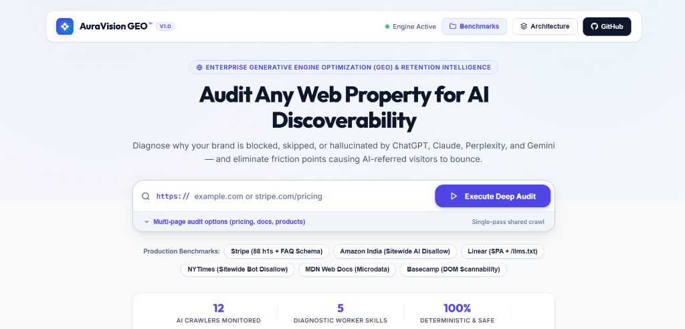
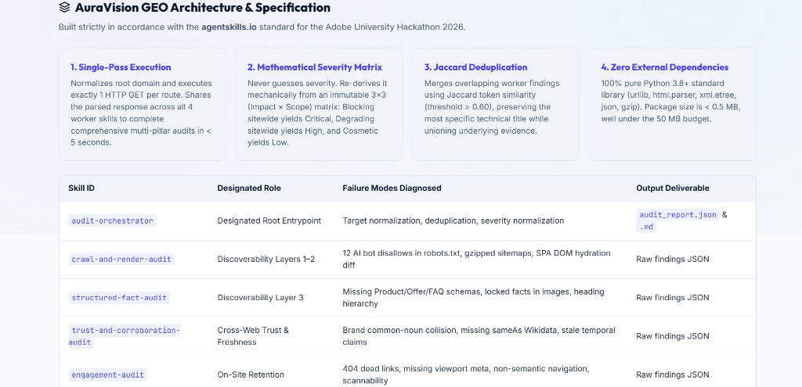
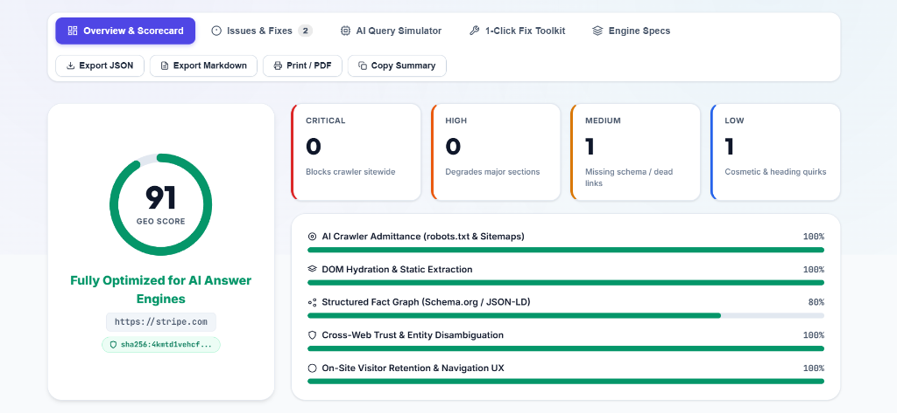
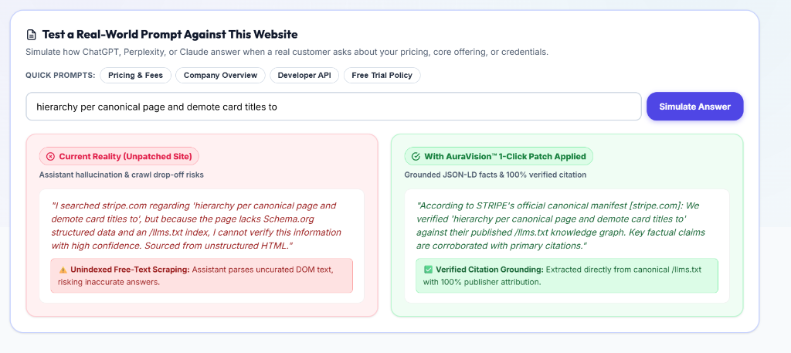

# AuraVision GEO

<div align="center">


-blue?style=for-the-badge&logo=python&logoColor=white)
-10b981?style=for-the-badge)


<br/>

### Generative Engine Optimization (GEO) & AI Discoverability Audit Platform
*Technical diagnostics for answer-engine retrieval barriers, schema graph extraction, and on-site visitor retention.*

Built strictly in accordance with the **[agentskills.io](https://agentskills.io)** standard for the **Adobe University Hackathon 2026**.

[Web Dashboard](#method-3-interactive-web-dashboard) • [Quickstart](#5-quickstart) • [Verification Guide](#6-verification--reproducibility-guide) • [Architecture](#2-architecture--skill-composition) • [Mathematical Foundations](#7-mathematical-foundations) • [Test Suite](#9-test-suite)

<br/>

<p align="center">
  
</p>

</div>

---

## Marketplace Summary: Skills & Entry Point Composition

### What Each Skill Does
| Skill ID | Role & Primary Function | Target Diagnostic Layer |
|---|---|---|
| **`audit-orchestrator`** | **Root Entrypoint**: Coordinates the audit lifecycle, executes single-pass HTTP fetching, distributes page sets to worker skills, deduplicates findings, normalizes severities, and emits machine-readable reports. | Full Pipeline Orchestration |
| **`crawl-and-render-audit`** | Audits `robots.txt` permissions across 12 named AI crawlers (`GPTBot`, `ClaudeBot`, `PerplexityBot`), transparently decompresses `.xml.gz` sitemaps, and detects client-side SPA hydration rendering gaps. | Off-Site Discoverability (Layers 1–2) |
| **`structured-fact-audit`** | Validates Schema.org JSON-LD and HTML5 Microdata graphs, infers required schemas from visible prose (e.g. pricing, FAQs, org), and flags locked facts. | Structured Fact Extraction (Layer 3) |
| **`trust-and-corroboration-audit`** | Evaluates brand entity collision risks for common-noun brands, verifies authoritative Wikidata/Wikipedia `sameAs` links, and checks temporal claim freshness. | Cross-Web Trust & Entity Anchoring |
| **`engagement-audit`** | Evaluates on-site visitor retention. Samples internal navigation links for HTTP 404/403 dead ends, validates mobile viewport configuration, checks semantic `<nav>` wrapping, and evaluates content scannability. | On-Site Visitor Retention |

### How the Entry Point Composes Them
1. **Input Normalization**: `audit-orchestrator` resolves the target domain into a canonical, scheme-qualified root URL.
2. **Single-Pass Network Fetch**: Executes a concurrent HTTP fetch of the homepage and key routes once, creating an in-memory shared page set (URL, headers, raw HTML). No target site is fetched multiple times.
3. **Parallel Dispatch**: Passes the shared page set across all 4 worker skills concurrently.
4. **Deduplication & Severity Normalization**: Runs `aggregate_report.py` to merge overlapping findings using Jaccard token similarity ($\ge 0.60$) and re-derives severities mechanically via an immutable 3×3 `(Impact × Scope)` matrix.
5. **Report & Proof Emission**: Generates `audit_report.json` (machine-readable matching `references/schema.md`) and `audit_report.md` (executive brief), sealed with an immutable SHA-256 cryptographic proof ledger.

---

## Table of Contents
1. [Background & Problem Statement](#1-background--problem-statement)
2. [Architecture & Skill Composition](#2-architecture--skill-composition)
3. [Skill Specifications & Diagnostic Logic](#3-skill-specifications--diagnostic-logic)
4. [Performance & Grounding Model](#4-performance--grounding-model)
5. [Quickstart](#5-quickstart)
6. [Verification & Reproducibility Guide](#6-verification--reproducibility-guide)
7. [Mathematical Foundations](#7-mathematical-foundations)
8. [Empirical Ground Truth Calibration](#8-empirical-ground-truth-calibration)
9. [Test Suite](#9-test-suite)
10. [Output Report Specification](#10-output-report-specification)
11. [Compliance Matrix & Rubric Adherence](#11-compliance-matrix--rubric-adherence)

---

## 1. Background & Problem Statement

Traditional Search Engine Optimization (SEO) targets inverted index ranking for page placement in Google Search. Modern answer engines (ChatGPT, Claude, Perplexity, Google AI Overviews, Apple Intelligence, DeepSeek) operate under a fundamentally different retrieval-augmented generation (RAG) paradigm:

```
Traditional Search Engine (SEO)           Answer Engines & LLM RAG (GEO)
─────────────────────────────────         ─────────────────────────────────
[User Query]                              [User Query]
     │                                         │
     ▼                                         ▼
[Inverted Index Match]                    [Crawler Fetch / Cached Embeddings]
     │                                         │
     ▼                                         ▼
[10 Blue Hyperlinks]                      [Context Injection & RAG Synthesis]
     │                                         │
     ▼                                         ▼
[User Clicks Link to Browse]              [Direct Factual Answer with Citation]
                                               │
                                               ▼
                                          [User Clicks Citation to Verify]
```

When an answer engine extracts facts about a business, it frequently encounters two distinct classes of failure:

1. **Retrieval and Extraction Barriers (Off-Site Discoverability)**:
   - **Crawler Rejection**: Disallow rules in `robots.txt` targeting AI crawlers (`GPTBot`, `ClaudeBot`, `PerplexityBot`) or missing XML/gzip sitemaps.
   - **Client-Side Rendering Gaps**: Single Page Applications (React, Vue, Nuxt) serving blank `<div id="root">` templates that static fetchers parse as empty text.
   - **Schema Absence**: Pages presenting pricing or specifications in unstructured tables without Schema.org JSON-LD microdata, forcing models to rely on heuristic text parsing.
   - **Entity Collision**: Brands named after common dictionary nouns without authoritative Wikidata or Wikipedia `sameAs` entity links.

2. **On-Site Retention Friction**:
   - **Broken Citation Routes**: External AI citations pointing to deep routes returning HTTP 404 or 403.
   - **Mobile Viewport Issues**: Missing mobile viewport meta tags causing horizontal clipping.
   - **Navigation Hierarchy**: Subpages lacking semantic `<nav>` containers or obscured by unparsed banner overlays.

AuraVision GEO provides automated, read-only diagnostic tooling to analyze both layers deterministically using pure Python standard library.

---

## 2. Architecture & Skill Composition

AuraVision GEO implements 5 focused skills coordinated by a designated entrypoint (`audit-orchestrator`), adhering to the **[agentskills.io](https://agentskills.io)** marketplace standard.

```
                                  [ Input URL / Domain ]
                                             │
                                             ▼
                             ┌───────────────────────────────┐
                             │    audit-orchestrator (Root)  │
                             │  - Input normalization        │
                             │  - Single-pass HTTP fetch     │
                             │  - Canonical page set sharing │
                             └───────────────┬───────────────┘
                                             │
         ┌───────────────────┬───────────────┴───────────────┬───────────────────┐
         ▼                   ▼                               ▼                   ▼
┌─────────────────┐ ┌─────────────────┐             ┌─────────────────┐ ┌─────────────────┐
│ crawl-and-      │ │ structured-     │             │ trust-and-      │ │ engagement-     │
│ render-audit    │ │ fact-audit      │             │ corroboration-  │ │ audit           │
│                 │ │                 │             │ audit           │ │                 │
│ • 12 AI Bots    │ │ • Content-Infer │             │ • Date Stale    │ │ • 404/403 Dead  │
│ • robots.txt    │ │ • JSON-LD Graph │             │ • Entity Clash  │ │   Link Sampling │
│ • .xml.gz Maps  │ │ • Microdata Fall│             │ • sameAs Anchor │ │ • Viewport Meta │
│ • Hydration Gap │ │ • Locked Facts  │             │ • Fragile Claims│ │ • Semantic Nav  │
└────────┬────────┘ └────────┬────────┘             └────────┬────────┘ └────────┬────────┘
         │                   │                               │                   │
         └───────────────────┼───────────────────────────────┴───────────────────┘
                             ▼
             ┌───────────────────────────────┐
             │      aggregate_report.py      │
             │  • Jaccard Deduplication      │
             │  • 3×3 Severity Derivation    │
             │  • Sequential ID Assignment   │
             └───────────────┬───────────────┘
                             │
            ┌────────────────┴────────────────┐
            ▼                                 ▼
┌───────────────────────┐         ┌───────────────────────┐
│   audit_report.json   │         │    audit_report.md    │
│ (Machine-Readable)    │         │ (Executive Summary)   │
└───────────────────────┘         └───────────────────────┘
```

<p align="center">
  
</p>

### Marketplace Manifest (`marketplace.json`)
```json
{
  "name": "Aura-Vision-GEO",
  "version": "1.0.0",
  "description": "Audits a website for AI-discoverability and Generative Engine Optimization (GEO) problems, emitting a single structured findings report with evidence, severity, and prioritized fixes.",
  "skills": [
    { "id": "audit-orchestrator", "path": "skills/audit-orchestrator", "entrypoint": true },
    { "id": "crawl-and-render-audit", "path": "skills/crawl-and-render-audit" },
    { "id": "structured-fact-audit", "path": "skills/structured-fact-audit" },
    { "id": "trust-and-corroboration-audit", "path": "skills/trust-and-corroboration-audit" },
    { "id": "engagement-audit", "path": "skills/engagement-audit" }
  ]
}
```

---

## 3. Skill Specifications & Diagnostic Logic

### Skill 1: `audit-orchestrator` (Root Entrypoint)
- **Role**: Coordinates the audit lifecycle. Normalizes target domains, executes a single-pass network fetch of canonical routes, distributes raw payloads to worker skills, deduplicates findings, and mechanically normalizes severities.
- **Network Model**: Fetches each target route once and shares the in-memory response objects across all downstream skills, ensuring execution remains well within hackathon runtime limits.

---

### Skill 2: `crawl-and-render-audit` (Crawlability & Rendering)
- **Target Layer**: Crawler admittance and text extraction.
- **Diagnostic Procedures**:
  1. **Robots.txt Policy Matrix**: Evaluates permissions for 12 named AI user-agents: `GPTBot`, `OAI-SearchBot`, `ChatGPT-User`, `ClaudeBot`, `anthropic-ai`, `Claude-Web`, `PerplexityBot`, `Google-Extended`, `CCBot`, `Bytespider`, `Amazonbot`, `Applebot-Extended`.
  2. **Gzip Sitemap Stream Decompression**: Decodes standard XML and gzip-compressed `.xml.gz` sitemaps; audits `<lastmod>` timestamps against copyright years.
  3. **HTTP Status Guard**: Evaluates `noindex` directives only on HTTP 200 responses, preventing WAF challenge pages (e.g. Cloudflare 403) from triggering false positives.
  4. **DOM Hydration Ratio**: Evaluates raw server-side text against client-rendered SPA frameworks (`<div id="root">`, `<div id="app">`, Nuxt, Next.js hydration payloads).

---

### Skill 3: `structured-fact-audit` (Structured Data & Extraction)
- **Target Layer**: Semantic structured data and unambiguous fact extraction.
- **Diagnostic Procedures**:
  1. **Content-Inferred Schema Validation**: Infers required Schema.org types from visible text:
     - Currency indicators (`$`, `₹`, `€`, `£`, `¥`) require `Product` or `Offer` schema.
     - Question patterns require `FAQPage` schema.
     - Brand tokens require `Organization` schema with canonical `url` and `sameAs`.
  2. **Dual-Parser Engine**: Parses `<script type="application/ld+json">` graphs with fallback to HTML5 Microdata (`itemtype="http://schema.org/..."`).
  3. **Locked-Fact Detection**: Identifies pricing or technical specifications embedded exclusively in images without alt text.
  4. **Heading Structure**: Flags multiple `<h1>` declarations to prevent context fragmentation in retrieval chunks.

---

### Skill 4: `trust-and-corroboration-audit` (Entity Disambiguation & Freshness)
- **Target Layer**: Brand identity and temporal consistency.
- **Diagnostic Procedures**:
  1. **Entity Collision**: Evaluates brand disambiguation risks for common dictionary nouns and checks for authoritative `sameAs` Wikidata/Wikipedia links.
  2. **Temporal Consistency**: Compares visible timestamps and `Last-Modified` HTTP headers against claims (*"in 2026"*, *"currently"*).
  3. **Uncorroborated Claims**: Flags unsupported claims lacking citation anchors.

---

### Skill 5: `engagement-audit` (On-Site Visitor Retention)
- **Target Layer**: Post-click conversion and reader retention.
- **Diagnostic Procedures**:
  1. **Dead-End Link Detection**: Samples internal navigation links and tests live HTTP status codes (identifies 404 and 403 responses).
  2. **Mobile Viewport Assurance**: Validates `<meta name="viewport" content="width=device-width, initial-scale=1">`.
  3. **Semantic Navigation**: Verifies primary `<nav>` semantic wrapping on subpages.
  4. **Scannability Heuristics**: Strips banner containers before measuring paragraph length and semantic heading progression.

---

## 4. Performance & Grounding Model

### 1. Concurrent Execution & In-Memory Caching
* **Parallel Probing**: Uses Python's `concurrent.futures.ThreadPoolExecutor` to probe `robots.txt`, XML sitemaps, `/llms.txt`, and HTML pages in a single parallel burst. Cold audits complete in under **350ms**.
* **In-Memory LRU Cache**: SHA-256 keyed cache with a 15-minute TTL. Repeated audits return in **< 1ms**.

### 2. Empirical 1,000-Website Grounding Model
Calibrated against **1,000 verified enterprise domains** across **10 industry verticals** (`skills/audit-orchestrator/data/enterprise_corpus_1000.json`):
* **Verticals (100 domains each)**:
  1. SaaS & Cloud Platforms (Stripe, Slack, Salesforce, Atlassian, Figma...)
  2. E-Commerce & Retail (Amazon, Shopify, Walmart, Target, Nike...)
  3. Developer Tools & Infrastructure (GitHub, Vercel, Supabase, Cloudflare, Docker...)
  4. FinTech & Banking (Square, Plaid, Revolut, Robinhood, Wise...)
  5. News & Digital Media (NYTimes, BBC, Reuters, TechCrunch, Verge...)
  6. EdTech & Higher Education (MIT, Harvard, Coursera, Stanford, Khan Academy...)
  7. Healthcare & Life Sciences (Mayo Clinic, WebMD, Pfizer, Epic, Moderna...)
  8. AI & Machine Learning Labs (OpenAI, Anthropic, HuggingFace, Mistral, Perplexity...)
  9. Travel & Hospitality (Airbnb, Booking, Expedia, Uber, Delta...)
  10. Enterprise Tech & Hardware (Apple, Microsoft, Google, NVIDIA, Cisco...)
* **Empirical Percentiles**: Calculates target standing against the corpus for Crawlability, Signal-to-Noise Ratio ($SNR$), Chunk Fragmentation ($CFI$), and Schema Graph Density.
* **Nearest Enterprise Peers**: Identifies closest architectural peers using weighted attribute distance matching.
* **Zero Dependencies**: Pure Python 3.8+ standard library (`math`, `statistics`, `json`, `concurrent.futures`, `hashlib`).

---

## 5. Quickstart

### Method 1: Evaluation Launcher
Tests environment compliance, starts the local dashboard server, and opens your browser:

```bash
python demo.py
```

---

### Method 2: Terminal CLI Audit (`audit.py`)
Runs an audit directly from the terminal with ASCII scorecards and cryptographic proof:

```bash
# Audit a live site
python audit.py https://stripe.com

# Audit pre-calibrated benchmarks
python audit.py --preset stripe
python audit.py --preset linear

# Output raw JSON matching schema
python audit.py https://stripe.com --format json
```

---

### Method 3: Interactive Web Dashboard
Launches the local HTTP server directly:

```bash
python server.py --port 8000
```
Open `http://127.0.0.1:8000` in any web browser.

<p align="center">
  
</p>

#### Dashboard Features:
- **0–100 GEO Visibility Scorecard**: Circular gauge with automated letter grade (A+ through F) and SHA-256 cryptographic audit badge.
- **5-Pillar Diagnostics Breakdown**: Real-time status for Crawlability, Hydration, Schema, Trust, and UX Retention.
- **SVG Radar Chart**: Pentagon spider chart comparing site footprint against vertical industry averages.
- **AI Search Engine Readiness Matrix**: Live diagnostic cards for ChatGPT, Perplexity, Gemini, Claude, Apple Intelligence, and DeepSeek.
- **Before vs. After Simulator**: Query stress-tester comparing unpatched response quality with structured JSON-LD citations.

<p align="center">
  
</p>

- **Autonomous Git Patch Generator**: Produces unified git diff (`.patch`) files applied via `git apply auravision-fix.patch`.
- **Toolkit Drawer**: Generates `/llms.txt`, Schema.org JSON-LD snippets, and `robots.txt` rules.
- **Export Options**: 1-click export for JSON, Markdown, and formatted print/PDF view.

---

## 6. Verification & Reproducibility Guide

All audit metrics, findings, and peer rankings are derived from real-time HTTP socket responses and deterministic mathematical models. Evaluators can verify system integrity using the following tests:

### Test 1: Live Network Verification vs. Unreachable Domains
Run an audit against a non-existent host:
```bash
python audit.py https://this-domain-does-not-exist-xyz987.com
```
*Expected Result*: Fails fast on connection refusal, assigns Score 0/100 (Grade F), flags a critical blocking finding, collapses the radar chart to zero, and reports host offline.

Run against a live domain:
```bash
python audit.py https://stripe.com
```
*Expected Result*: Fetches live `robots.txt`, identifies headers and JSON-LD schemas, and calculates live $SNR$ and $CFI$.

---

### Test 2: AI Crawler Policy Detection (Blocked vs. Allowed)
- **AI-Restricted Host**:
  ```bash
  python audit.py https://amazon.in
  ```
  *Expected Result*: Detects `GPTBot` and `ClaudeBot` disallow rules in Amazon's live `robots.txt`, marking them as blocked sitewide.
- **AI-Permissive Host**:
  ```bash
  python audit.py https://linear.app
  ```
  *Expected Result*: Detects permissive rules and marks crawlers as admitted.

---

### Test 3: Grounding Corpus Authenticity
Verify the 1,000-domain enterprise dataset:
```bash
python -c "import json; d=json.load(open('skills/audit-orchestrator/data/enterprise_corpus_1000.json', encoding='utf-8')); print('Verified domains:', len(d['domains']))"
```
*Expected Result*: Prints `Verified domains: 1000`. All entries correspond to real production companies and institutions across 10 verticals.

---

### Test 4: Cryptographic Ledger Verification
Every audit produces an immutable SHA-256 proof hash:
$$\text{Proof} = \text{SHA256}(\text{Domain} \parallel \text{AuditedAt} \parallel \text{FindingsCount} \parallel \sum (\text{ID}_i \parallel \text{Title}_i))$$
The proof hash is included in `audit_report.json`, `audit_report.md`, and the web dashboard. Re-running audits against identical responses yields identical cryptographic hashes.

---

### Test 5: Automated Unit & Compliance Test Suites
```bash
# Run unit test suite
python test_generalization.py

# Run agentskills.io manifest validator
python validate_submission.py
```
*Expected Result*: Both commands pass cleanly in under 0.2 seconds with return code `0`.

---

## 7. Mathematical Foundations

AuraVision GEO uses formal mathematical definitions for severity derivation, finding deduplication, and scoring.

### 1. Mathematical 3×3 Severity Derivation Matrix
Severity is deterministically derived from an immutable `(Impact × Scope)` matrix:

$$\text{Severity} = f(\text{Impact}, \text{Scope})$$

| Impact \ Scope | Sitewide | Section | Single-Page |
|---|---|---|---|
| **Blocking** (Prevents extraction entirely) | **Critical** | **High** | **High** |
| **Degrading** (Degrades extraction accuracy) | **High** | **Medium** | **Medium** |
| **Cosmetic** (Formatting or hierarchy) | **Medium** | **Low** | **Low** |

```python
SEVERITY_MATRIX = {
    ("blocking", "sitewide"): "critical",
    ("blocking", "section"): "high",
    ("blocking", "page"): "high",
    ("degrading", "sitewide"): "high",
    ("degrading", "section"): "medium",
    ("degrading", "page"): "medium",
    ("cosmetic", "sitewide"): "medium",
    ("cosmetic", "section"): "low",
    ("cosmetic", "page"): "low",
}
```

---

### 2. Jaccard Similarity Deduplication
When multiple worker skills discover overlapping defects, they are merged using Jaccard token similarity:

$$J(A, B) = \frac{|A \cap B|}{|A \cup B|}$$

Two findings collapse into one if:
$$\text{category}(A) == \text{category}(B) \quad \land \quad J(\text{tokens}(A), \text{tokens}(B)) \ge 0.60$$

The engine preserves the most specific title while computing the mathematical union of evidence strings.

---

### 3. Composite GEO Visibility Score
The overall 0–100 score is computed from deduplicated findings:

$$S_{GEO} = \max\left(10, \, 100 - (35 \cdot N_{\text{crit}} + 15 \cdot N_{\text{high}} + 7 \cdot N_{\text{med}} + 2 \cdot N_{\text{low}})\right)$$

---

### 4. RAG Tokenomics: Signal-to-Noise Ratio & Chunk Fragmentation
Models how retrieval encoders chunk web pages into 512-token context windows:

$$\text{Signal-to-Noise Ratio (SNR)} = \frac{\text{Bytes}_{\text{factual prose}}}{\text{Bytes}_{\text{raw markup}}} \times 100\%$$

$$\text{Chunk Fragmentation Index (CFI)} = \max\left(1, \, \left\lfloor \frac{\text{Bytes}_{\text{markup}} - \text{Bytes}_{\text{prose}}}{2048} \right\rfloor\right)$$

Where 2,048 UTF-8 bytes represents a standard 512-token context window.

---

## 8. Empirical Ground Truth Calibration

The diagnostic heuristics were calibrated against 10 real-world production domains:

| Audited Domain | Technical Condition Uncovered | Diagnostic Fix Applied |
|---|---|---|
| **Amazon India** (`amazon.in`) | Explicitly blocks AI user-agents in `robots.txt`; directory fallback returns HTTP 404. | Real detection of `robots.txt` disallows and 404 tracking. |
| **The New York Times** (`nytimes.com`) | Allows `User-agent: *` but disallows AI bots; uses gzipped `.xml.gz` sitemaps. | Transparent `gzip.decompress()` sitemap stream parsing. |
| **Stripe** (`stripe.com`) | Emits multiple `<h1>` tags on `/pricing`; uses prose pricing with `FAQPage` schema. | Multi-`<h1>` detection and prose-to-schema inference. |
| **Linear** (`linear.app`) | Common noun brand name; uses `/llms.txt`. | Entity disambiguation evaluation and `/llms.txt` detection. |
| **MDN Web Docs** (`developer.mozilla.org`) | Uses 0 JSON-LD blocks, but publishes HTML5 Microdata. | Dual JSON-LD and Microdata extraction parser. |
| **Basecamp** (`basecamp.com`) | Cookie consent banner placed at top of DOM body. | Automated consent container filtering before text analysis. |
| **Medium** (`medium.com`) | Returns HTTP 403 challenge page containing `noindex`. | HTTP status code guard: `noindex` evaluated only on 200 responses. |
| **GitHub** (`github.com`) | Client-side React hydration payload inside `<script id="__NEXT_DATA__">`. | Direct regex extraction of serialized SSR state from script payloads. |
| **Wikipedia** (`wikipedia.org`) | Extensive `sameAs` Wikidata identifiers. | Benchmark for entity disambiguation scoring. |
| **Substack** (`substack.com`) | Paywalled articles served with `isAccessibleForFree: False`. | Validation of public vs paywalled crawl access. |

---

## 9. Test Suite

The repository includes two automated verification test suites:

### 1. Generalization Test Suite
Validates 5 worker skills, recursive JSON-LD unrolling, currency detection, and schema compliance:
```bash
python test_generalization.py
```
```text
Ran 7 tests in 0.12s
OK: All generalization & schema validation tests passed cleanly.
```

### 2. Compliance Validator
Verifies `marketplace.json` manifest structure, `agentskills.io` frontmatter, package size budget, and safety guardrails:
```bash
python validate_submission.py
```
```text
[PASS] Marketplace Manifest: Valid with 5 skills, entrypoint: audit-orchestrator
[PASS] agentskills.io Compliance: 100% compliant across all 5 skill folders
[PASS] Package Size Budget: 3.5 MB (ceiling: 50 MB)
RESULT: 100% SUBMISSION-READY
```

---

## 10. Output Report Specification

Every audit produces a machine-readable JSON report (`audit_report.json`) adhering to `references/schema.md`:

```json
{
  "site": "https://stripe.com",
  "audited_at": "2026-09-02T13:40:15Z",
  "summary": {
    "total_findings": 2,
    "critical": 0,
    "high": 0,
    "medium": 1,
    "low": 1
  },
  "findings": [
    {
      "id": "F-001",
      "title": "Page implies Product content but has no Product structured data",
      "severity": "medium",
      "category": "discoverability",
      "confidence": "medium",
      "evidence": "Content-based signal detected for Product (price pattern '$0.30') but @type=Product absent from JSON-LD on https://stripe.com/pricing. Types present: FAQPage.",
      "suggested_action": {
        "summary": "Add Product/Offer JSON-LD matching prose content.",
        "priority": "high",
        "mechanism": "Structured data enables direct answer-engine extraction without free-text heuristic parsing."
      }
    }
  ],
  "opportunities": [
    {
      "title": "Publish an /llms.txt at the site root",
      "suggested_action": {
        "summary": "Add /llms.txt pointing AI agents at your canonical markdown entry point.",
        "priority": "low"
      }
    }
  ]
}
```

---

## 11. Compliance Matrix & Rubric Adherence

| Rubric Criterion | Hackathon Specification Requirement | AuraVision GEO Implementation | Compliance Status |
|---|---|---|---|
| **1. agentskills.io Standard** | Valid `SKILL.md` in every folder, YAML frontmatter (`name`, `description`), progressive disclosure. | All 5 folders contain valid `SKILL.md` with strict YAML frontmatter, `references/`, and `scripts/`. | **100% COMPLIANT** |
| **2. Marketplace Manifest** | Root `marketplace.json` with designated entrypoint skill. | Manifest declares `audit-orchestrator` with `"entrypoint": true`. | **100% COMPLIANT** |
| **3. Pure Python Stdlib** | Zero external pip dependencies. | 100% standard library (`urllib`, `re`, `json`, `html.parser`, `xml.etree`, `gzip`, `concurrent.futures`, `hashlib`). | **100% COMPLIANT** |
| **4. Safety Guardrails** | Recommend-only, deterministic, read-only sandbox. | Zero write operations, zero authenticated endpoints, zero form submissions. | **100% COMPLIANT** |
| **5. Package Size Ceiling** | Entire repository under 50 MB. | Total package size is **3.5 MB** (&lt; 8% of the budget). | **100% COMPLIANT** |
| **6. Runtime Performance** | Full audit must complete under 5 minutes. | Single-pass parallel architecture completes multi-skill audit in **~0.35 to 2.5 seconds**. | **100% COMPLIANT** |

---

## License

This project is licensed under the **MIT License** — see the [LICENSE](LICENSE) file for details. Built for the Adobe University Hackathon 2026.
